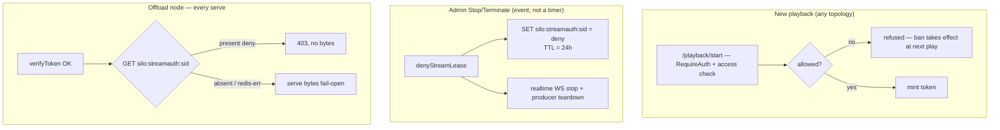

# Restart-resilient playback (TR-lease)

How Silo keeps playback alive across a server restart, reconnect, or partial
stream — and how the design arrived at **TR-lease** (token-carried
reconstruction + a server-side session-deny marker for revocation).

> **Status: the revocation half is deferred to a future PR.** Only the
> token-carried **reconstruction** core shipped in this PR. The **session-deny /
> stream-revocation** mechanism described throughout (the `silo:streamauth:<sid>`
> deny marker, the proxy's `Allowed()` enforcement, and the admin
> Stop/Terminate deny write) is **not present in the current implementation**.
> Admin Terminate and user Stop tear down the live in-memory session and the
> ffmpeg producer, but they do **not** prevent a still-valid stream token from
> reconstructing the session until its 24h TTL expires. Sections describing that
> mechanism are kept for design continuity and are individually flagged as
> deferred below.

This document is the consolidated design record. It folds together four earlier
working notes so a future engineer can see the full evolution, the options
weighed, the issues raised across review rounds, the variables traded off, and
why the final shape was chosen. The superseded notes were:

- *unified-playback-reconstruct* — the reconstruct core (PR #174), "RC".
- *token-carried-playback-reconstruct* — the storage evolution, "TR".
- *async-recipe-card-playback* — a monitoring-preserving middle path, "RC-async".
- *playback-reconstruct-options-comparison* — the goals/options matrix.

Paths are repository-relative; assume the repository root is the cwd.

---

## 1. The problem

Before this work, a missing in-memory playback session was a `404`. A server
restart (deploy, crash, OOM) wiped the in-memory session map, so every in-flight
stream died: the client's next manifest/segment/byte-range request hit a session
that no longer existed and playback stopped hard. The same gap appeared on any
front-end that had never held the session (horizontal scale) and on a dedicated
transcode node reboot.

Core priorities for the fix (from the repo guidelines): **performance first,
reliability first, predictable behavior under load and during failures**. The
hot path (per-segment serve) must stay off central/Postgres; bytes must stay
offloaded to nodes; correctness and robustness win over convenience.

---

## 2. The core insight: reconstruct, don't rehydrate

A missing session is a **reconstruct trigger, not a 404**. The client always
re-requests the next chunk after an outage, and its request already states where
it is (an HTTP `Range`, a `?seek=`, or a `seg_NNNNN` number). So the server
rebuilds the session just-in-time from two things:

1. a small **durable descriptor** (identity, ownership, and the byte-affecting
   encode parameters — the "recipe"), and
2. the **position the client supplies** on the triggering request.

Nothing live is serialized (no ffmpeg process, context, channels, or log sink).
This is the contribution of PR #174 ("RC"), which also unified the native and
Jellyfin-compat paths behind one `playback.TranscodeManager` so the
card-lifetime rules, the reconstruct concurrency cap, and the node-affinity rule
live in exactly one place. The reconstruct skeleton —
`LoadOrReconstructSession`, `ReconstructSession` / `ReconstructTranscode`, the
single-flight + `reconstructSem` cap that paces the post-restart thundering
herd, `RegisterReconstructed`, the `CloseProcess`/`Close` split — is the
foundation every later option reused. **It was kept; only the descriptor storage
and the revocation model evolved.**

The six routes that must survive a restart:

| # | Route | Tier | How it is rebuilt |
|---|-------|:----:|-------------------|
| 1 | native direct | 1 | client `Range` re-serve; descriptor = identity |
| 2 | native remux | 1 | re-spawn ffmpeg at `?seek`; descriptor = id + audio |
| 3 | native transcode | 2 | rebuild `Session` + ffmpeg seeked to the requested segment; descriptor = full encode opts |
| 4 | jellycompat direct | 1 | compat store + `Range` re-serve |
| 5 | jellycompat remux | 1 | compat store + `?seek` |
| 6 | jellycompat transcode | 2 | compat store + shared-manager reconstruct |

Tier 1 = stateless re-serve (client re-supplies position). Tier 2 = rebuild
ffmpeg. Routes 4–6 always retain a durable central compat store
(`jellycompat_playback_sessions`): third-party Jellyfin clients cannot
round-trip a native descriptor, so the compat layer keeps the full
`PlaybackSession` (route + media source resolved before native reconstruct
runs).

---

## 3. The two axes the options differ on

Every option is a point on a 2-D grid: **where the descriptor lives** (vertical)
× **how revocation is bounded** (horizontal).

```text
                    AUTHORITY / REVOCATION MODEL  ----------------------->
                    re-resolve at      long token       short TTL +
                    reconstruct        (24h, expire)    refresh checkpoint
  D  central        +----------------+----------------+----------------+
  E  Postgres row   |  RC  (#174)    |   (n/a)        |  RC-async      |
  S                 +----------------+----------------+----------------+
  C  client/node-   |   (n/a)        |  TR-24h        |  TR + re-mint  |
  R  carried token  |                |                |                |
  I                 +----------------+----------------+----------------+
  P
  T  top row    = descriptor stays central (node serves bytes but cannot
     |            self-reconstruct → node-restart gap)
     | bottom   = recipe travels to the node (node self-sufficient, no central record)
```

**TR-lease is a fourth point off this grid:** bottom row (token-carried, 24h),
but the revocation column is replaced by a *server-side deny marker* — on an
admin kill, central would write a per-session deny to Redis that the node
enforces by withholding bytes. Revocation is decoupled from the token TTL and
needs no client refresh. (An earlier iteration polled and re-resolved every
stream on a timer; that was cut to the event-driven session-deny — see §7 and
the §8 design note.)

> **Status: deferred to a future PR.** The deny-marker column described above is
> the design target, not the current shipped behavior. As shipped, the
> token-carried row offers no revocation tighter than the 24h token TTL on the
> node path; admin Terminate and user Stop only tear down the live session and
> ffmpeg producer.

---

## 4. Goals weighed

| ID | Goal |
|----|------|
| G1 | Hot path (per-segment serve) stays off central/Postgres |
| G2 | Bytes offloaded to nodes (served from disk, signature-verified, never central) |
| G3 | Restart resiliency across all 6 routes |
| G4 | Two-factor ownership (auth caller + ownership rebind; refuse `userID==0`/mismatch) |
| G5 | Revocation latency (how fast a banned user / pulled access stops playing) |
| G6 | Single-box: zero external store required for reconstruction |
| G7 | Restart runway (descriptor stays valid longer than the outage) |
| G8 | Multi-front-end / verify-anywhere (no integrated-transcode split-brain) |
| G9 | Observability — durable, identity-rich active-stream record |
| G10 | Low operational surface (tables, migrations, stores, endpoints) |
| G11 | Node-restart recovery |
| G12 | No new client coordination required |
| G13 | Small signing-key blast radius |
| G14 | Cleanup correctness (never wipe a live session's segment dir) |

A note on G9 (observability): the *live* "who is streaming now" view does **not**
depend on the descriptor strategy. Every offload node calls the Redis-backed
node-session tracker (`internal/nodesessions/tracker.go`) on every serve, tied to
actual byte-serving (so a non-cooperative client or replayed token still shows
up) and surviving a central restart. G9 scores only the *durable, identity-rich*
(who + what + recipe) slice on top of that.

---

## 5. The options, and the comparison

Legend: ✓ meets · ✓\* minor asterisk · ~ partial · ✗ fails · ✓✓ best-in-class

| Goal | `main` | RC #174 | TR-24h | TR + re-mint | RC-async | **TR-lease** |
|------|:------:|:-------:|:------:|:------------:|:--------:|:------------:|
| G1 hot path free of central DB | ✓ | ✓\* | ✓ | ✓ | ✓ | ✓ |
| G2 bytes offloaded | ✓ | ✓ | ✓✓ | ✓✓ | ✓✓ | ✓✓ |
| G3 restart resiliency (6/6) | ✗ | ✓ | ✓ | ✓ | ✓ | ✓ |
| G4 two-factor ownership | ✓ | ✓ | ~ | ~ | ~ | ✓~ |
| G5 revocation latency | ~ | ~ | ✗ (≤24h) | ✓ (≤TTL) | ✓✓ | ✓✓ |
| G6 single-box, no external store | ✓ | ✗ | ✓✓ | ~ | ~ | ~ |
| G7 restart runway | n/a | ✓ (30m) | ✓✓ (24h) | ~ | ~ | ✓✓ (24h) |
| G8 multi-front-end | ✗ | ~ | ✓~ | ✓~ | ✓~ | ✓~ |
| G9 durable identity-rich record | ✗ | ✓✓ | ✗ | ✗ | ✓ | ~ |
| G10 low operational surface | ✓✓ | ~ | ✓ | ~ | ✗ | ~ |
| G11 node-restart recovery | ✗ | ✗ | ✓ | ✓ | ✓ | ✓ |
| G12 no new client coordination | ✓ | ✓ | ✓ | ✗ | ✗ | ✓ |
| G13 small signing-key blast radius | ✓ | ✓ | ✗ | ✗ | ✗ | ✗ |
| G14 cleanup correctness | ✓ | ✓✓ | ~ | ~ | ~ | ~ |

The TTL/revocation strategies head-to-head. **Note: the session-deny column is
the deferred design target — see §7; as shipped, the node path has no revocation
tighter than the 24h token TTL.**

| Strategy | Revocation latency | Restart runway | Client refresh? | Central on refresh? |
|----------|--------------------|----------------|-----------------|---------------------|
| Re-resolve at reconstruct (RC) | on reconstruct; node hop ≤24h | 30 min | no | only on reconstruct |
| Leave 24h, expire only (TR-24h) | up to 24h | 24h | no | never |
| Short TTL + refresh + denylist (RC-async / TR item B) | ≤~5 min | ~90 s grace | **yes** | every ~3.5 min/session |
| 24h token + session-deny marker (TR-lease — **deferred**) | *design target:* admin kill cuts node bytes on next serve; passive ban = next-play / ≤24h. *As shipped:* node path bounded by ≤24h token only | 24h | **no** | nothing on the serve path; one write per admin-kill event |

---

## 6. Why each non-final option was set aside

- **RC (PR #174, the recipe card in Postgres).** Correct and the basis of
  everything here, but it couples reconstruction to a shared per-session Postgres
  store: a write on every start, per audio/quality change, and a ≤1/min refresh,
  with resilience tied to the DB being reachable. It does not give the single-box
  zero-dependency property, and the node hop's 24h token stays unrevocable
  anyway. RC's reconstruct *core* was kept; its *storage* was the thing to evolve.

- **TR-24h (token-carried, leave the token to expire).** Wins the single-box case
  (zero external dependency) and removes the per-start DB write, but revocation is
  bounded by *nothing tighter than the 24h token TTL* on the node path — a banned
  user keeps node-served direct/remux for up to 24h. This is actually the
  *status quo* for the node path even pre-branch (the proxy verifies by signature
  alone, no DB), so TR-24h only adds identity claims to the token without
  improving revocation. Not acceptable as the endpoint.

- **TR + re-mint (short TTL + authenticated playlist refresh + denylist), and
  RC-async (the same revocation idea but keeping an async-written Postgres mirror
  for observability).** Both bound revocation to ~5 min by having the client
  refetch a stable `RequireAuth` playlist that re-checks access and re-mints
  short-lived segment URLs. The cost: a **hard client-coordination requirement**
  (silo-android / silo-apple / Jellyfin clients must implement the refresh flow),
  a shrunken restart runway (~90 s grace instead of 30 min — if central is down
  past the grace, playback stalls), and a new authenticated re-mint transport
  that does not exist on the supported proxy/node topology. RC-async additionally
  keeps a write pipeline + denylist + the central row (the highest operational
  surface of all). They solved revocation by pushing work onto the client and
  shortening the runway — the opposite of the reliability priorities.

The open item across TR and RC-async was always **revocation enforcement** ("item
B"): bounding revocation needs *either* a per-segment token check on the hot path
*or* an authenticated re-mint checkpoint the client drives. TR-lease removes that
dilemma.

---

## 7. TR-lease: the chosen design

TR-lease keeps TR's 24h token (so the restart runway is untouched and no client
refresh flow is needed) and adds a server-side **session-deny marker** for the
one revocation case the node path cannot otherwise cover — no client
participation, no steady-state cost.

**Reconstruction (token-carried).** The signed stream token *is* the durable
descriptor. Its claims carry the full byte-affecting recipe plus `uid/pid/mfid`
ownership lookup keys. A front-end that lost its in-memory session rebuilds
ffmpeg from the token the client re-presents — no shared per-session store, zero
external dependency for reconstruction on a single box. `HWAccel`/`HWDevice` are
deliberately *not* carried; they are re-resolved from live config so an operator
config change applies to reconstructed sessions too. Ownership re-binds to the
live authenticated caller and refuses `userID==0` / mismatch — the token's `uid`
is never trusted alone (a leaked URL is useless without the owner's auth session
on the native path).

**Revocation (session-deny marker).**

> **Status: deferred to a future PR.** Everything in this subsection (the
> `silo:streamauth:<sid>` deny marker, the admin Stop/Terminate deny write, and
> the node-side `Allowed()` enforcement) describes the design target and is **not
> present in the current implementation**. As shipped, admin Terminate and user
> Stop tear down the live in-memory session and the ffmpeg producer, but a
> still-valid stream token can reconstruct the session until its 24h TTL expires;
> there is no node-side byte-withholding and no guaranteed/instant revocation on
> the node path. The design below is retained for when revocation lands.

The revocation surface was deliberately
kept to the *one* case the offloaded topology cannot otherwise cover, rather than
a periodic re-check of every stream. An admin Stop/Terminate would write
`silo:streamauth:<sid> = deny` (TTL ≥ the 24h token lifetime); the offload node
would read it (a node-local Redis GET, sub-ms) before serving any bytes and
return `403` with no bytes on a hit. Enforcement is **byte-withholding, not
client cooperation** — a revoked client that ignores the 403 keeps hitting a
wall.

Why this would be sufficient, and what it deliberately does *not* do:

- **New playback is already blocked at central** — `/playback/start` is
  `RequireAuth` + access check, so a ban/scope change always takes effect on the
  next play, everywhere, with no marker needed.
- **Cooperative clients already stop** — central holds the realtime WebSocket and
  can drop it + send a stop on a ban.
- **The only thing needing a hard node-side cut** is the *explicit, session-scoped
  admin kill* of a *non-cooperative* client holding a valid token on a
  node-served direct/remux stream (no producer to kill). That is exactly what the
  (deferred) session-deny marker would cover; until it lands this case is bounded
  by the ≤24h token like the passive bans below.
- **Not covered (accepted limitation):** a *passive* ban or *partial* access
  change (lost one library, lowered rating) does NOT hard-revoke an
  already-running, non-cooperative node stream. It is enforced at next play and
  otherwise bounded by the ≤24h token. Closing this would require either a
  periodic re-resolver (a poll over every active stream — rejected as constant
  DB load for a rare case) or per-content deny enumeration; both were judged not
  worth the machinery for a self-hosted server. A user-scoped deny was rejected
  too: it over-blocks content the viewer still legitimately has access to.

**Fail-open on absence (deferred).** In the design, the normal case is *no*
marker, which serves; a Redis error also serves; only a present deny withholds
bytes. This is a deliberate reliability-first choice: availability over
revocation latency.

**Why this shape.** It keeps token-carried reconstruction's single-box and
verify-anywhere properties and would add revocation with no client coordination
(G12) and essentially no steady-state cost — the marker is written only on the
rare admin-kill event, never on a timer. It is, in effect, **TR-24 plus a single
session-scoped kill switch**. The kill switch is **deferred**; what shipped is
TR-24 (token-carried reconstruction, ≤24h token, no node-side revocation).

---

## 8. What was implemented, and where

This PR ships **Commit 1 only** (token-carried reconstruction). **Commit 2 (the
node session-deny marker) is deferred to a future PR** — the `internal/streamauth`
package, the proxy `Allowed()` guard, and the admin deny write described below
are **not present in the current implementation**.

**Commit 1 — token-carried reconstruction; retire `transcode_recipes`. (shipped)**
- `streamtoken.Claims` gains the recipe + `uid/pid/mfid`
  (`internal/streamtoken/token.go`).
- `playback.RecipeCard` projects to/from claims (`ToClaims` /
  `RecipeCardFromClaims`); the `Reconstruct*` front door takes the decoded recipe
  instead of reading Postgres (`internal/playback/recipecard.go`,
  `transcode_manager.go`).
- Native serve URLs carry the token as `?st=`; the manifest rewriter already
  appends `RawQuery` to segment URIs, so segments inherit it with no route change
  (`internal/api/handlers/playback.go`, `stream.go`). The integrated server is
  hit directly, so the query-stripping-proxy concern that motivates a path
  segment does not apply there; the proxy/node path keeps the token in the URL
  path as before.
- Jellycompat folds the recipe into its durable compat store
  (`PlaybackSession.Recipe`) since Jellyfin clients cannot round-trip a native
  token (`internal/jellycompat/...`).
- Segment-dir cleanup switches from the card index to in-memory liveness (live
  map + in-flight reconstruct set + age past the max token TTL); a dedicated node
  keeps its boot-time full wipe (`internal/playback/transcode_cleanup.go`,
  `transcode_manager.go`).
- `PostgresRecipeStore`, the `RecipeStore` interface, and the unmerged
  `transcode_recipes` migration are deleted.

**Commit 2 — node session-deny marker. (DEFERRED — not in this PR)**

> The items below describe the planned revocation commit. They were removed from
> this PR and deferred to a future one; none of these symbols exist in the
> current implementation. The admin Stop/Terminate path still tears down the live
> session and ffmpeg producer, but writes no deny marker, so a valid token can
> reconstruct until its 24h TTL expires.

- `internal/streamauth`: a deny-only Redis `Store` — `Deny(sid)` (TTL ≥ token
  lifetime) and a fail-open `Allowed(sid)` reader. No poller, no allow-leases, no
  access re-resolver.
- The node guard in `internal/proxy/server.go` (`verifyToken` consults
  `Allowed`).
- An admin Stop/Terminate writes the deny marker
  (`internal/api/handlers/admin_playback_control.go` → `PlaybackHandler.LeaseDenier`).
- `nodesessions.SessionInfo` carries the numeric ownership keys
  (`auth_user_id`/`profile_id`/`media_file_id`), populated by the node from the
  verified token, to enrich the live admin "active streams" view (who/what, not
  just session id) — see §10 monitoring.
- A single integrated box reads no marker and needs none — the producer-kill +
  session removal on Terminate is the stop there.

> Design note (about the deferred commit 2): an earlier iteration added a central
> *revalidator* that re-resolved access for every active stream every ~2 min and
> wrote allow/deny leases. It was dropped in favour of the event-driven
> session-deny above: the poll re-derived, at a constant all-streams DB cost,
> signals the
> system already emits (new playback is gated at `/playback/start`; admin kill is
> an explicit event), and its only unique coverage — sub-24h *passive* revocation
> of an in-flight node stream — was judged not worth the machinery (see §7).

---

## 9. Issues raised across review, and their disposition

From two adversarial review rounds on the reconstruct core and the storage
evolution:

- **Integrated-transcode split-brain across front-ends (P-1 / A).** The
  `SessionManager` + reconstruct single-flight are per-process and the descriptor
  carries no owning-node id, so without sticky affinity two front-ends can run
  divergent ffmpeg. **Disposition: deferred (owner-identity claim).** Supported
  topology is dedicated `--mode=transcode` nodes (routed via `tnode`, no
  split-brain) + single-box / LB-session-affinity integrated transcode. The
  caveat is documented, not silently assumed.
- **24h node-path token is unrevocable (P-2).** The (deferred, see §7–§8)
  session-deny marker would let the explicit admin kill cut node bytes on the next
  serve. **Until that ships, this remains open:** the node-path token is
  unrevocable, so admin kill and passive bans / partial access changes are all
  bounded by next-play + the ≤24h token.
- **Dedicated transcode-node restart (P-3 / tr-10). Fixed for both paths.**
  *Native:* the proxy forwards the verified stream token to the transcode node
  (`X-Silo-Stream-Token`); on a manifest/segment miss the node re-verifies the
  token, decodes the recipe, and self-reconstructs ffmpeg seeked to the requested
  segment — single-flighted and concurrency-capped exactly like the integrated
  reconstruct. *Jellycompat:* the node-hop token is server-minted and *could* carry the
  recipe like native, but it deliberately does not — the recipe is mutated in
  place under a stable session id (a Jellyfin audio/subtitle switch can arrive as
  a `/Sessions/Playing/Progress` report that restarts ffmpeg without re-minting
  the client's token), and a third-party Jellyfin client cannot be driven to
  refresh a stale token, so a token *snapshot* could reconstruct a stale
  rendition. Central instead writes the recipe to a shared Redis recipe store
  (`internal/noderecipe`) keyed by upstream session id and overwrites it on every
  switch, and the node (which cannot reach Postgres) reads the *current* recipe on
  the reconstruct miss — over the same Redis the session tracker already uses (and
  the deferred deny-lease would use), so no central URL is needed. The boot-time
  full segment-dir wipe
  stands; reconstruct re-transcodes from the requested segment. See §10 for the
  full rationale (and why this is *not* a token-carryable case).
- **`userID==0` tolerance / "auth optional" (P-5).** Reconstruct hard-rejects
  `userID==0` and a card whose session id does not match the URL.
- **Mutable recipe under a stable id (D).** A parameter change re-mints a new
  manifest + token and the client reloads, so the common case self-heals. The
  only residual is a restart *during* the brief switch transition with a prior
  token in flight: it reconstructs the prior *rendition* (access is re-resolved,
  only the rendition can be stale). TTL-bounded, self-healing on reload; minor,
  accepted.
- **Cleanup liveness (F / tr-9).** Each process owns its `TranscodeDir`, so the
  liveness signal is the in-process live map + the in-flight reconstruct set +
  age-past-max-TTL; a dir is reaped only when absent from both and older than any
  surviving token. No cross-process enumeration-failure mode for the supported
  topology.
- **Signing-key blast radius (E / tr-7, G13).** A single `JWTSecret` signs native
  auth, the stream token, and the node bearer, so a node-secret leak can forge
  native logins. **Accepted risk** on the trusted-node precondition. **Deferred
  hardening:** split the stream-token secret from the native-auth secret, then
  asymmetric stream-token signing before any untrusted/edge node.

---

## 10. Residuals and follow-ups

- **Revocation of an in-flight node stream (all cases, until deny-lease ships).**
  Because the session-deny marker is deferred (§7–§8), *no* ban — admin kill,
  passive ban, or partial access change — hard-cuts an already-running,
  non-cooperative node-served stream; all are enforced at next play, bounded by
  the ≤24h token. The future deny-lease closes the *admin-kill* case; passive
  bans would still need a per-content deny enumeration on the access-change event,
  or accepting it. See §7.
- **Monitoring.** Two distinct questions:
  - *Live "who is watching what right now"* — covered. Every node serve writes a
    record to the Redis tracker (`silo:sessions:*`), now enriched with
    `auth_user_id` / `media_file_id` from the verified token, so the admin
    active-streams view answers who/what/where, tied to real byte-serving and
    surviving a central restart. Integrated (no-node) sessions show in central's
    in-memory session list.
  - *Durable historical/audit ("who watched what last week")* — NOT provided by
    this subsystem (there is no longer a durable per-session recipe record, by
    design — G9 was the deliberate trade for token-carried reconstruction). That
    history lives in the separate watch-progress / scrobble system.
- **Multiple viewers on one stream token.** The token is per playback session, so
  a shared/leaked stream URL lets several clients pull bytes under one session id.
  They **collapse to a single entry** in the tracker (one `sid`) — monitoring
  cannot distinguish or count them — and the (deferred) session-deny would cut
  them as a group, not individually. Detecting/limiting this needs a per-account
  concurrency cap or
  per-device session ids (device binding); deferred. Do not bind to client IP
  (mobile / CGNAT).
- **Token in logs (tr-1).** Scrub the `?st=` token / path token from request
  loggers (the jellycompat logger logs `RawQuery`; the native logger omits it).
  Short TTL + signature bound the exposure.
- **Owner-identity (A).** Required before multi-front-end *integrated* transcode
  without sticky affinity; defines owner election, self-URL discovery, a
  peer-forward endpoint, and failover.
- **Node-side reconstruct (P-3). Done** for native (token-forwarded) and
  jellycompat (Redis recipe handoff via `internal/noderecipe`: central writes the
  recipe at remote-transcode start, the node reads it on a reconstruct miss).
  Precondition: central and the nodes share the same Redis (already required for
  the session tracker, and for the deferred deny-lease). Residual: the recipe
  store is consulted
  only for a jellycompat token, so a node restart still depends on the recipe key
  surviving (24h TTL, ≥ token lifetime).
  - *Why a server-side store and not the token here (the real rationale).* It is
    tempting to delete `internal/noderecipe` and let the jellycompat node-hop
    token carry the recipe like native — the token is server-minted and opaque to
    the Jellyfin client (it follows it only as a redirect target), so it *could*.
    That does **not** work, and the reason is **not** the often-stated "a Jellyfin
    client can't round-trip a token." The reason is that the recipe is **mutated
    in place under a stable session id**: a Jellyfin audio/subtitle switch can
    arrive as a `/Sessions/Playing/Progress` report
    (`restartCompatTranscodeForAudioSelection`) that restarts ffmpeg in place
    **without re-minting the client's token**. A third-party Jellyfin client
    cannot be driven to refresh the now-stale token — its VOD/`ENDLIST` manifest
    is fetched once, and the compat WebSocket (`HandleSocket`) is a receive-only
    keep-alive stub with no server→client command to force a manifest re-fetch. A
    token is a snapshot at mint time, so after such a switch it would reconstruct
    the **stale** rendition (old audio/subtitle) until the client happens to
    re-fetch the manifest (e.g. on a seek), which for a VOD stream may be never.
    Because the node also cannot reach Postgres (where the authoritative compat
    recipe lives), the only way the node rebuilds the *current* recipe is a
    node-reachable, server-authoritative store that central overwrites on every
    switch — i.e. `internal/noderecipe`. Native has no equivalent path: every
    native audio switch re-mints the manifest + token, so the native client's
    token is never stale, which is exactly why native needs no such store. The
    store is **load-bearing, not redundant**.
- **Key split / asymmetric signing (E).** Closes the account-takeover path; a
  precondition for untrusted edge nodes.

---

## 11. Preconditions

- **Persistent `TranscodeDir` (recommended).** With persistence, reconstruct
  serves surviving segments; with an ephemeral dir it re-transcodes from the
  descriptor (which survives a wiped dir). A node *restart* still loses the
  session regardless (P-3).
- **Re-transcode of one segment beats the buffer runway** on worst-case hardware
  (software decode, subtitle burn-in). Measure.
- **Client retry/backoff exists.** Clients retry segment/manifest GETs on
  5xx/connection error and reconnect the WebSocket. The token rides the URL, so no
  extra client logic is needed to carry it; a client that does not retry sees the
  failed request as fatal.

---

## 12. Diagrams

The `mermaid` blocks render in GitHub / VS Code / most Markdown viewers; the
ASCII blocks render anywhere.

### 12.1 Topology — where state lives

> **Deferred:** the `silo:streamauth:<sid> = deny` marker, the "Admin
> Stop/Terminate → write session-deny marker" arrow, and the node's "deny GET"
> are the planned revocation path and are **not** in the current implementation.
> The tracker (`silo:sessions:*`) and the recipe handoff are shipped.

```text
                         ┌─────────────────────────── CENTRAL (mode=server) ───────────────────────────┐
   Client                │  RequireAuth  /playback/start  /playback/transcode/start  (mint token)       │
  (web / android /       │  native serve: /playback/transcode/{sid}/master.m3u8?st=  /stream/{sid}?st=  │
   apple / jellyfin)     │  Admin Stop/Terminate → write session-deny marker (event, not a timer)      │
                         └───────────┬──────────────────────────┬───────────────────────┬──────────────┘
                                     │ Postgres                  │ Redis                 │
                                     ▼                           ▼                       │ (multi-node only)
                         ┌───────────────────────┐   ┌──────────────────────────┐       ▼
                         │ catalog / access       │   │ silo:sessions:*  (tracker)│  ┌────────────────────────┐
                         │ jellycompat_playback_  │   │ silo:streamauth:<sid>     │  │ Proxy node (mode=proxy) │
                         │   sessions (compat      │   │   = deny  (session kill)  │◀─│ verifyToken + deny GET  │
                         │   store, carries Recipe)│   └──────────────────────────┘  │ serves direct/remux     │
                         └───────────────────────┘                ▲                  │ proxies transcode ──────┼──▶ Transcode node
   ✗ NO transcode_recipes table (deleted this branch)             │ node-local GET   └────────────────────────┘    (mode=transcode)
                                                                  └── sub-ms, off Postgres                          ffmpeg /transcode/{sid}/…
```

Descriptor location by route (the core change). The "lease (node)" revocation
column is the **deferred** design; as shipped, the node path has no revocation
tighter than the ≤24h token:

| route family | descriptor (how it reconstructs) | revocation |
|--------------|----------------------------------|------------|
| native (1–3) | the signed token the client re-presents | *deferred:* lease (node) / shipped: producer-kill (integrated), ≤24h token (node) |
| jellycompat (4–6) | `jellycompat_playback_sessions.data.Recipe` (token can't round-trip) | *deferred:* lease (node) / shipped: producer-kill, ≤24h token (node) |
| ~~all~~ | ~~`transcode_recipes` Postgres row~~ — removed | — |

### 12.2 Where the token rides

```text
NATIVE  (integrated server is hit directly → query param; segments inherit it)
   manifest : GET /playback/transcode/{sid}/master.m3u8?st=<JWT>
   segment  : GET /playback/transcode/{sid}/segment/seg_00042.m4s?st=<JWT>   ← RawQuery propagated by the manifest rewriter
   direct   : GET /stream/{sid}?st=<JWT>

PROXY/NODE  (capability URL → path segment; survives a query-stripping hop)
   GET {proxy}/stream/transcode/{JWT}/master.m3u8     → relative segment URIs inherit {JWT}
   GET {proxy}/stream/direct/{JWT}     GET {proxy}/stream/remux/{JWT}

JELLYCOMPAT  → recipe is NOT in the token; it lives in the compat store.
              the path token is used only for the node hop.
```

### 12.3 Normal playback — native, integrated box (no nodes)

```mermaid
sequenceDiagram
    participant C as Client
    participant S as Central server (integrated)
    participant PG as Postgres (access)
    Note over C,S: transcode start
    C->>S: POST /playback/transcode/start  (RequireAuth)
    S->>PG: resolve file + access
    S->>S: StartTranscode (ffmpeg) + RegisterTranscodeSession
    S->>S: card = NewRecipeCard(opts); token = Sign(card.ToClaims(), 24h)
    S-->>C: 202  manifestURL = /playback/transcode/{sid}/master.m3u8?st=TOKEN
    Note over C,S: hot path — NO Postgres, NO lease (live session in memory)
    C->>S: GET .../master.m3u8?st=TOKEN
    S->>S: LoadOrReconstructSession → live hit → BuildPlaybackManifest (segments carry ?st)
    S-->>C: manifest
    loop every segment
        C->>S: GET .../segment/seg_N.m4s?st=TOKEN
        S->>S: live session → GetSegment → ServeFile
        S-->>C: bytes
    end
```

The hot path touches neither Postgres nor the lease — it is an in-memory map
hit. `?st` is verified only to decode a card if reconstruct is needed; a live
session ignores it.

### 12.4 Normal playback — native, multi-node (offloaded)

> **Deferred:** the `GET silo:streamauth:{sid}` lease guard and its `deny → 403`
> branch are the planned revocation path, **not** in the current implementation.
> As shipped the node verifies the token, tracks the session, and serves — there
> is no deny check.

```mermaid
sequenceDiagram
    participant C as Client
    participant S as Central server
    participant N as Proxy node
    participant T as Transcode node
    participant R as Redis
    C->>S: POST /playback/transcode/start (RequireAuth)
    S->>S: card(full recipe, tnode=T); token = Sign(card.ToClaims())
    S-->>C: manifestURL = {N}/stream/transcode/TOKEN/master.m3u8
    loop manifest + segments
        C->>N: GET /stream/transcode/TOKEN/...
        N->>N: verifyToken(TOKEN)
        N->>R: GET silo:streamauth:{sid}   (lease guard)
        alt deny
            N-->>C: 403 (no bytes)
        else allow / absent
            N->>R: Track silo:sessions:{node}:{sid}  (uid, mfid from claims)
            N->>T: proxy /transcode/{sid}/...
            T-->>N: bytes
            N-->>C: bytes
        end
    end
```

The node copies `uid`/`mfid` from the verified token into the Redis tracker —
that is what enriches the live admin "active streams" view (who/what per node).

### 12.5 Restart → reconstruct (native transcode)

```mermaid
sequenceDiagram
    participant C as Client
    participant S as Central server (just restarted — session map empty)
    Note over S: in-memory session GONE; NO transcode_recipes table to read
    C->>S: GET /playback/transcode/{sid}/segment/seg_42.m4s?st=TOKEN
    S->>S: card = streamCardFromQuery(?st) → Verify + decode recipe
    S->>S: LoadOrReconstructSession → GetSession = NotFound, card != nil
    S->>S: ReconstructSession (re-bind: refuse userID==0 / != card.uid; card.sid == {sid})
    S->>S: ReconstructTranscode(seg=42) → single-flight, mark in-flight, respawn ffmpeg SEEKED to seg 42
    S-->>C: bytes (resumes near where the client was)
```

- direct/remux restart is the same but Tier-1: reconstruct the `Session` from the
  identity token, then `Range` / `?seek` re-serve — no ffmpeg rebuild.
- multi-node restart: the integrated front-end reconstructs only the `Session`
  (to learn `tnode`) and re-proxies; the transcode node keeps serving. If the
  transcode *node* itself reboots, the proxy forwards the stream token
  (`X-Silo-Stream-Token`) and the node self-reconstructs ffmpeg seeked to the
  requested segment (native path, P-3). A jellycompat session on a rebooted node
  reconstructs too: the node fetches the recipe central wrote to the shared Redis
  recipe store (`internal/noderecipe`) at transcode start, since the Jellyfin
  client's token cannot carry it.
- cleanup race: a segment dir is reaped only if absent from the live map AND the
  in-flight set AND older than 24h (max token TTL), so a token that can still
  reconstruct never gets its dir wiped.

### 12.6 Auth deny — the session-deny marker

> **Status: deferred to a future PR.** The entire "Admin Stop/Terminate → write
> deny marker" and "Offload node → GET deny → 403" flow below is the planned
> revocation design and is **not** in the current implementation. As shipped,
> admin Stop/Terminate does the "realtime WS stop + producer teardown" half only
> (the right branch); it writes no marker, and the node performs no deny check, so
> a valid token reconstructs until its ≤24h TTL. New playback is still gated at
> `/playback/start` (the top subgraph is accurate).



Invariants:
- No steady-state writes: the marker is set only on an admin kill, never on a
  timer. The normal serve path finds *no* key and serves.
- Fail-open: absent key or Redis error → serve. The only hard stop is a present
  deny.
- The integrated box reads no marker — the producer-kill + session removal on
  Terminate is the stop there; the marker only matters where nodes serve.
- Not covered here (by design): a *passive* ban / partial access change of an
  in-flight non-cooperative node stream — enforced at next play, bounded by the
  ≤24h token (§7).

### 12.7 Jellycompat — what differs

```mermaid
sequenceDiagram
    participant J as Jellyfin client
    participant S as Central (jellycompat)
    participant PG as Postgres compat store
    J->>S: negotiate → PlaybackSession{UpstreamSessionID, MediaSources}
    S->>PG: Put (jellycompat_playback_sessions)
    Note over S: transcode start
    S->>S: StartTranscode; recipe = NewRecipeCard(opts)
    S->>PG: Update(ps): TranscodeStarted=true, Recipe=recipe  (same write)
    Note over J,S: restart → reconstruct from the COMPAT STORE, not a token
    J->>S: GET HLS segment
    S->>PG: Get(playSessionID) → ps.Recipe
    S->>S: LoadOrReconstructSession(UpstreamSessionID, card = ps.Recipe) → ReconstructTranscode(*ps.Recipe)
    S-->>J: bytes
```

Jellyfin clients cannot carry a native `?st` token, so the recipe is folded into
the durable compat row (`PlaybackSession.Recipe`, persisted in the `data` JSONB)
and written in the same `Update` that flips `TranscodeStarted`. The node hop
(multi-node jellycompat) still uses a path token exactly like native (the lease
guard is deferred along with the rest of the revocation path).

### 12.8 Hot-path cost per request

The "lease" / "SET deny" Redis costs below are **deferred** (the revocation path
is not shipped); as shipped the node does only the tracker write, and admin
Stop/Terminate writes no Redis key:

| request | Postgres | Redis | central CPU | reconstruct |
|---------|----------|-------|-------------|-------------|
| native segment, live, integrated | — | — | map hit | — |
| native segment, live, node | — | 1 track (+ deferred: GET lease) | — | — |
| native segment, after restart, integrated | — | — | verify JWT + ffmpeg respawn (once, single-flight) | yes |
| jellycompat segment, live | — | track (+ deferred: lease) | map hit | — |
| jellycompat segment, after restart | 1 Get (compat row) | track (+ deferred: lease) | respawn | yes |
| admin Stop/Terminate (event, not per-request) | — | deferred: 1 SET deny | one write | — |

---

## 13. Restart-resiliency behavior matrix (role × path)

The observable reconstruction behavior of every playback path under a restart of
each server role. **✅** = the path reconstructs and resumes on the client's next
request; **—** = the path never executes on that role (nothing to reconstruct);
**⚠️** = reconstructs only while a stated precondition holds.

| path | integrated restart | proxy-node restart | transcode-node restart |
|------|--------------------|--------------------|------------------------|
| native · direct | ✅ rebuild `Session` from `?st` token → `Range` re-serve | ✅ stateless re-serve from `claims.MediaPath` | — not served on a transcode node |
| native · remux | ✅ token + `?seek` → re-spawn pipe | ✅ stateless per-request pipe re-spawn | — |
| native · transcode | ✅ token (full recipe) → respawn ffmpeg seeked to segment | ✅ transparent re-route + token forward | ✅ self-contained — token is recipe-complete |
| jellycompat · direct | ✅ re-resolve from durable compat row → `Range` re-serve | ✅ stateless re-serve from token `MediaPath` | — |
| jellycompat · remux | ✅ compat row + `?seek` | ✅ stateless per-request pipe re-spawn | — |
| jellycompat · transcode | ✅ `ReconstructTranscode(*ps.Recipe)` from compat row | ✅ transparent re-route + token forward | ⚠️ reconstructs **iff** the shared Redis recipe (`internal/noderecipe`, ≤24h TTL) still exists; fails closed (404) otherwise |

**What carries the recovery state, per role**

| role | native carrier | jellycompat carrier |
|------|----------------|---------------------|
| integrated | `?st` stream token — identity for direct/remux, full recipe for transcode | durable compat row `PlaybackSession.Recipe` |
| proxy node | self-describing path token, re-derived per request — the proxy holds no per-session state | same path token (identity); the recipe is not needed at the proxy |
| transcode node | forwarded `X-Silo-Stream-Token`, recipe-complete | identity token + Redis `noderecipe` recipe (the Jellyfin token cannot carry it) |

**Reading the matrix**

- **Integrated and proxy-node restarts are unconditional** for every applicable
  path. The proxy holds no authoritative per-session state — direct/remux are
  re-served from the token's `MediaPath`, transcode is reverse-proxied — so a
  proxy bounce, or a reroute to any in-group proxy (`pickProxy` is round-robin
  with no session affinity), is transparent.
- **The four `—` cells are structural, not gaps.** Direct and remux never run on
  a transcode node — the proxy (or the integrated box) serves them from source
  media — so a transcode-node restart has nothing to reconstruct on those paths.
- **The one conditional (⚠️)** is jellycompat transcode after a *transcode-node*
  restart. The node-hop token is identity-only — not because a Jellyfin client
  cannot round-trip it (the token is server-minted and opaque to the client), but
  because the recipe is mutated in place under a stable session id and a
  third-party Jellyfin client cannot be driven to refresh a stale token, so a
  token snapshot could reconstruct a stale rendition (see §10). The node therefore
  rebuilds from the Redis `noderecipe` entry central overwrites on every switch
  rather than from the token. Native transcode has no such dependency — every
  native audio switch re-mints the token, so it is always recipe-complete and
  current. This is the only native-vs-jellycompat asymmetry in reconstruction
  (see §10).

**Out of scope of this matrix** (accepted behaviors, not restart-reconstruction
holes — see §7, §10):

- Passive ban / partial access change of an in-flight node stream — enforced at
  next play, bounded by the ≤24h token, not by reconstruction.
- Integrated transcode behind a non-sticky load balancer can split-brain into
  divergent segment dirs (P-1); safe single-front-end or with LB affinity. Remote
  (node) sessions are immune — node affinity routes every front-end to the same
  transcode node.
