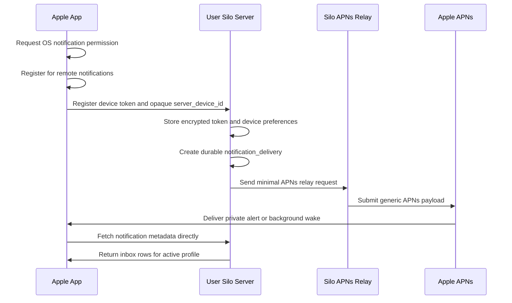

# Privacy-Preserving APNs Relay Spec

**Date:** 2026-04-27 (refined 2026-04-28)
**Status:** Draft (refined; open questions resolved)
**Scope:** Silo server push integration, Apple clients, opt-in central APNs relay, custom APNs provider configuration
**Depends On:**
- [`00-architecture-overview.md`](./00-architecture-overview.md) — read first for cross-cutting context
- [`01-release-events-and-inbox.md`](./01-release-events-and-inbox.md) — foundational durable inbox + fanout
**Sibling spec:**
- [`03-fcm-relay.md`](./03-fcm-relay.md) — Android push using the same threat model and architecture

## Summary

Silo should support remote Apple notifications through either an opt-in
central APNs relay or admin-configured APNs credentials, while keeping
notification metadata on the user's own Silo server.

The hosted relay should be a constrained transport service. It should receive
only the minimum fields needed to submit an APNs request:

- an APNs device token
- APNs environment and app topic
- a push mode
- an opaque server/device correlation key
- an opaque delivery identifier
- optional badge count

Neither provider path may send titles, item names, usernames, profile names,
library names, server URLs, artwork URLs, watched-state metadata, or
notification body text through APNs.

When the Apple device wakes, the app should fetch real notification metadata
directly from the user's Silo server using the existing authenticated
server connection.

## Problem

Reliable Apple remote notifications require APNs. A self-hosted Silo server
cannot directly wake an iPhone, iPad, or Apple TV app in the background without
going through Apple's push infrastructure.

That creates two product concerns:

1. Privacy: notification contents should not be exposed to Apple or a Silo
   operated relay.
2. Operational friction: most server admins should not need to create and manage
   their own Apple developer account, APNs key, bundle topic, and push service.

Silo should offer a practical default that preserves the self-hosted trust
model as much as the platform allows.

## Decision

Add configurable Apple push providers for the official Apple app:

- `off`: no remote Apple push
- `silo_relay`: Silo's hosted APNs relay
- `custom_apns`: admin-supplied APNs credentials used directly by the server

The relay submits APNs requests using Silo-controlled Apple credentials for
the official app bundle. A self-hosted server admin may opt in to use this relay.
The relay's API should intentionally prevent notification content from being
sent through the relay.

If `custom_apns` is selected, the user's Silo server submits directly to
APNs using admin-provided Apple developer credentials. This avoids the Silo
relay entirely, but it must use the same minimal payload and metadata-fetch
rules as the hosted relay path.

The default push mode should be **Private Alert**:

- APNs displays a generic Silo notification.
- The APNs payload contains only opaque identifiers.
- The app fetches the actual notification row from the user's server when it is
  opened or granted background execution.

The implementation should also support **Background Wake** for low-noise sync,
with the explicit understanding that iOS background pushes are opportunistic and
not a reliable user-visible notification mechanism.

## Goals

- Make Apple push possible without every admin managing APNs credentials.
- Keep actual notification metadata on the user's Silo server.
- Make relay participation explicit and disabled by default.
- Make APNs credentials configurable for admins who want to avoid the hosted
  relay.
- Keep the relay stateless for device subscriptions where possible.
- Keep APNs payloads opaque and generic.
- Keep the hosted relay and custom APNs paths behaviorally equivalent from the
  app's point of view.
- Fit on top of the durable notification inbox design.

## Non-Goals

- Replacing APNs for Apple remote push.
- Shipping notification content through the central relay.
- Requiring Firebase or Google services for this Apple path.
- Solving Android push in this spec.
- Adding marketing, analytics, or delivery-tracking exports to the relay.
- Hiding APNs itself from Apple devices. Custom APNs still uses Apple APNs.
- Making silent background delivery as reliable as visible push.

## Threat Model

### What The User's Server Knows

The user's Silo server knows:

- the notification content
- the profile and user recipients
- the registered local devices
- APNs device tokens for those devices
- push delivery attempts and failures

This is acceptable because the server is already the authority for the user's
media, profiles, sessions, and notification inbox.

### What The Central Relay May Know

The relay may see:

- an opt-in relay account or install identifier
- the server's egress IP address (inherent to any hosted relay — the server
  connects to it directly; for home hosting this identifies the household's
  connection, making it the closest thing to an identity leak in this design)
- APNs device tokens submitted in send requests
- request timestamps
- coarse push mode, such as `private_alert` or `background_wake`
- opaque `collapse_id` values (per-server-keyed HMACs of series identity; the
  relay can group one server's pushes into series-equivalence classes but
  cannot recover which series, nor correlate across servers — see "Send Apple
  Push" validation)
- APNs response status and APNs request IDs
- opaque delivery identifiers

The relay must not receive enough information to know what media item,
notification type, profile, user, library, server hostname, or server URL caused
the push.

### What Apple May Know

Apple/APNs may see:

- the official app topic
- the target device token
- APNs headers
- request timing
- the generic APNs payload

Apple must not receive media titles, usernames, library names, server URLs,
artwork URLs, or other notification metadata in the payload.

### Residual Metadata Leakage

This design cannot hide that a device received a Silo push at a particular
time, nor the egress IP of the server sending relay requests. It can only hide
the meaning and content of the push. Admins for whom IP exposure matters can
route relay traffic through their existing VPN/proxy egress; the relay path is
plain HTTPS and needs no special handling.

## User And Admin Controls

### Server Admin Control

The server admin must explicitly choose an Apple push provider.

Suggested setting:

```text
notifications.apple_push.provider = off | silo_relay | custom_apns
```

Default:

```text
off
```

If `silo_relay` is selected, the admin configures a relay API key and
accepts a clear privacy notice:

```text
Silo Relay can wake Apple devices through APNs, but notification details
stay on this server. The relay receives APNs device tokens, timestamps, opaque
delivery IDs, and generic push mode only.
```

If `custom_apns` is selected, the admin configures their own Apple developer
APNs credentials:

```text
notifications.apple_push.custom.team_id
notifications.apple_push.custom.key_id
notifications.apple_push.custom.private_key
notifications.apple_push.custom.default_environment = production | sandbox
notifications.apple_push.custom.allowed_topics = [...]
```

The server then sends directly to APNs and does not call the Silo relay.
The same private payload rules still apply.

### Device User Control

Each Apple device must opt in independently:

- the OS notification permission must be granted
- the app must be signed into a Silo server
- the active profile must enable push notifications for that device
- the server admin must have enabled an Apple push provider

Admins must not be able to silently enroll every profile/device into remote push
without the device having granted OS notification permission.

### Profile Control

Push preferences should sit on top of the durable notification preferences from
the inbox design.

Suggested profile/device modes:

- `off`: never send remote push to this device
- `in_app_only`: websocket and inbox only
- `private_push`: generic APNs wake/alert, fetch details from server
- `full_preview`: out of scope for v1; would require explicit user consent and
  a separate privacy warning

V1 should ship only `off`, `in_app_only`, and `private_push`.

## System Architecture



## Ownership Boundaries

### This Repository

Silo owns:

- admin settings for selecting a push provider
- profile and device notification preferences
- APNs token registration from Apple clients
- durable storage of device registrations
- push fanout from `notification_deliveries`
- relay client integration
- retry, backoff, and APNs error handling
- inbox sync APIs used after wake

### Apple Client Repository

The Apple app owns:

- APNs registration
- notification permission UX
- device registration API calls
- local server/device correlation
- wake handling
- fetching metadata from the user's server
- rendering local/in-app notification details

### Central Relay Service

The central relay owns:

- APNs provider credentials for official Silo bundle topics
- relay API authentication
- request validation and rate limiting
- APNs request submission
- redacted operational logs
- minimal delivery status reporting

The relay should live outside this repo unless the project later decides to
co-locate the service code. This repo should define the contract and implement
the self-hosted server side.

### Custom APNs Mode

When `custom_apns` is selected, there is no central relay in the send path.

The user's Silo server owns:

- APNs provider authentication using the configured team ID, key ID, and private
  key
- topic allowlisting for the official Silo app bundle IDs it intends to
  support
- sandbox vs production environment selection
- APNs request construction
- APNs response handling
- APNs credential rotation and secret storage

Custom APNs mode must not unlock richer payloads. It exists to let admins avoid
the Silo relay, not to bypass the privacy-preserving notification contract.

## Data Model

This spec assumes `notification_deliveries` exists from the durable notification
inbox design.

### `push_devices`

Purpose: profile/device-scoped remote push registration. Shared across Apple and Android — see [`03-fcm-relay.md`](./03-fcm-relay.md) for the FCM-specific columns.

Columns:

- `id text primary key`
- `user_id integer not null` (matches `users.id integer`)
- `profile_id text not null`
- `device_id text not null`
- `platform text not null` — `'apple'` or `'android'`. Required; the row is invalid without it.
- `provider text not null` — for Apple rows: `'silo_relay'` or `'custom_apns'`. For Android rows: `'silo_relay'` or `'custom_fcm'`. (Effectively the active configured provider at registration time; updates rewrite the row.)
- `apns_environment text` — `'production'` / `'sandbox'`. Nullable; populated only for `platform = 'apple'`.
- `apns_topic text` — bundle topic. Nullable; populated only for `platform = 'apple'`.
- `apns_token_ciphertext bytea` — nullable; populated only for `platform = 'apple'`.
- `apns_token_hash text` — nullable; populated only for `platform = 'apple'`.
- `fcm_token_ciphertext bytea` — nullable; populated only for `platform = 'android'`. Defined here so the table is forward-compatible with [`03-fcm-relay.md`](./03-fcm-relay.md); the FCM spec adds the rest of the Android-specific columns.
- `fcm_token_hash text` — nullable; Android only.
- `fcm_project_id text` — nullable; Android only.
- `fcm_package_name text` — nullable; Android only.
- `server_device_id text not null` — random opaque value, generated server-side at registration. Stable across token rotation; rotates only when the device is removed and re-registered.
- `push_mode text not null default 'private_push'` — profile-level mode (see [`00-architecture-overview.md`](./00-architecture-overview.md) "Mode terminology").
- `enabled boolean not null default true`
- `last_seen_at timestamptz`
- `last_success_at timestamptz`
- `last_failure_at timestamptz`
- `last_failure_code text`
- `created_at timestamptz not null default now()`
- `updated_at timestamptz not null default now()`

Constraints:

- unique on `(profile_id, device_id, platform)` — a device can register exactly once per platform per profile, regardless of which provider the admin happens to have configured. This matters because admins may flip between `silo_relay` and `custom_apns` mid-rotation; a `provider`-scoped unique key would leave stale rows behind.
- unique on `(server_device_id)`
- `CHECK ((platform = 'apple' AND apns_token_hash IS NOT NULL AND fcm_token_hash IS NULL) OR (platform = 'android' AND fcm_token_hash IS NOT NULL AND apns_token_hash IS NULL))` — exactly the platform-appropriate token columns are populated.

Notes:

- `server_device_id` must be random and opaque. It is the value included in the
  APNs payload so the app can map the push back to the correct local server
  account.
- Store APNs tokens encrypted at rest when the local encryption facility exists.
- Store `apns_token_hash` for dedupe and diagnostics without logging raw tokens.

### `push_delivery_attempts`

Purpose: operational record of push attempts without notification content.

Columns:

- `id text primary key`
- `notification_delivery_id text not null`
- `push_device_id text not null`
- `provider text not null`
- `attempt_number integer not null` — 1-based counter incremented on each retry. Used as the `Idempotency-Key` suffix for relay calls (see Send Apple Push), and lets diagnostics distinguish "10 attempts of one delivery" from "10 deliveries each first-attempted".
- `relay_request_id text`
- `apns_id text` — Apple's APNs ID returned in the response. Nullable; null for FCM rows.
- `fcm_message_name text` — FCM v1 message name (see [`03-fcm-relay.md`](./03-fcm-relay.md)). Nullable; null for APNs rows.
- `status text not null` — `'pending'`, `'delivered'`, `'retrying'`, `'failed'`, `'device_disabled'`. `pending` rows are the dispatch outbox: the fanout transaction in [`01-release-events-and-inbox.md`](./01-release-events-and-inbox.md) inserts attempt 1 as `pending` in the same transaction as the delivery; the push dispatcher claims and sends them post-commit.
- `failure_code text`
- `attempted_at timestamptz not null default now()`
- `next_retry_at timestamptz`

Constraints:

- unique on `(notification_delivery_id, push_device_id, attempt_number)` to make the relay's `Idempotency-Key` deterministic and prevent double-claims of an attempt.
- add an index on `(status, next_retry_at)` for retry workers. The same index serves outbox recovery: a sweeper claims `pending` rows older than ~60s (crash between delivery commit and dispatch) with `FOR UPDATE SKIP LOCKED`.

Retention:

- keep successful attempts for a short operational window, such as 14 days
- keep failed attempts longer, such as 30 to 90 days, to diagnose device issues

## Server API Surface

### Register Apple Push Device

```http
POST /api/v1/devices/push/apple
```

Profile-scoped. Requires normal auth plus active profile context.

Request:

```json
{
  "device_id": "apple-device-local-id",
  "apns_token": "hex-or-base64-token",
  "apns_environment": "production",
  "apns_topic": "com.continuum.app.ios",
  "push_mode": "private_push"
}
```

Response:

```json
{
  "id": "01J...",
  "server_device_id": "01JOPAQUE...",
  "enabled": true,
  "push_mode": "private_push"
}
```

Rules:

- `apns_topic` must be allowlisted by app build/channel.
- `apns_environment` must be `sandbox` or `production`.
- registration is idempotent by `(profile_id, device_id, provider)`.
- token rotation updates the encrypted token and token hash.
- a disabled server push provider should still allow registration, but should
  report that remote push is unavailable in a capability field if the frontend
  needs it.

### Disable Push Device

```http
DELETE /api/v1/devices/push/{id}
```

Profile-scoped and idempotent.

The server may either delete the row or mark `enabled = false`. Marking disabled
is preferred for diagnostics and future re-enable flows.

### Push Capability

```http
GET /api/v1/notifications/capability
```

The full envelope is defined in [`00-architecture-overview.md`](./00-architecture-overview.md). The Apple-relevant slice is:

```json
{
  "apple_push": {
    "available": true,
    "provider": "silo_relay",
    "available_providers": ["silo_relay", "custom_apns"],
    "supported_modes": ["private_push", "in_app_only"],
    "privacy_mode": "metadata_fetch"
  }
}
```

The full response also includes `in_app`, `android_push` (see [`03-fcm-relay.md`](./03-fcm-relay.md)), and `webhooks` (see [`04-outbound-webhooks.md`](./04-outbound-webhooks.md)).

This lets clients present truthful setup UI without guessing whether the admin
has enabled remote push.

## Relay API Contract

The relay API should be intentionally narrow. The user server should not send an
arbitrary APNs payload.

### Send Apple Push

```http
POST /v1/apple/send
Authorization: Bearer <relay_api_key>
Idempotency-Key: <notification_delivery_id>:<push_device_id>:<attempt_number>
```

Request:

```json
{
  "token": "apns-token",
  "environment": "production",
  "topic": "com.continuum.app.ios",
  "mode": "private_alert",
  "server_device_id": "01JOPAQUE...",
  "delivery_id": "01JDELIVERY...",
  "badge": null,
  "collapse_id": "01JOPAQUE_COLLAPSE"
}
```

Response:

```json
{
  "request_id": "01JRELAY...",
  "apns_id": "550e8400-e29b-41d4-a716-446655440000",
  "status": "accepted"
}
```

Validation:

- `token` is required and must be plausible for APNs.
- `environment` must be `sandbox` or `production`. The relay forwards `production` requests to `https://api.push.apple.com` and `sandbox` requests to `https://api.development.push.apple.com` (Apple's current canonical hostnames; older docs/libraries also reference `api.sandbox.push.apple.com`, but `api.development.push.apple.com` is the current Apple-documented form).
- `topic` must be allowlisted for the relay account.
- `mode` must be `private_alert` or `background_wake`.
- `server_device_id` and `delivery_id` must be opaque values with length limits (recommend ≤128 chars, ULID-shaped).
- `collapse_id` must be opaque and ≤64 bytes — Apple enforces a 64-byte cap on `apns-collapse-id`. Reject longer values with HTTP 400.
- `collapse_id` derivation (server-side rule, not relay-enforced): the server computes `collapse_id = base32(HMAC-SHA256(server_collapse_secret, series_id))` truncated to 26 chars, where `server_collapse_secret` is a random per-server secret generated at first use. Never send raw or plainly-hashed `series_id` — an unkeyed hash would let the relay (or Apple) dictionary-match popular series IDs. Residual: the relay can still group one server's pushes into per-series equivalence classes (that is what collapse is for); the per-server key prevents recovering the series or correlating across servers.
- `badge` is optional. Default should be omitted to avoid leaking unread counts through APNs unless the user/admin explicitly enables badge sync.
- no free-form notification title or body fields are accepted.
- no image URL, media ID, username, server hostname, or server URL field is accepted.

### Relay-Built APNs Payloads

For `private_alert`, the relay constructs:

```json
{
  "aps": {
    "alert": {
      "title-loc-key": "SILO_NOTIFICATION_TITLE",
      "loc-key": "SILO_NOTIFICATION_GENERIC_BODY"
    },
    "sound": "default"
  },
  "silo": {
    "v": 1,
    "wake": "notifications.changed",
    "server_device_id": "01JOPAQUE...",
    "delivery_id": "01JDELIVERY..."
  }
}
```

For `background_wake`, the relay constructs:

```json
{
  "aps": {
    "content-available": 1
  },
  "silo": {
    "v": 1,
    "wake": "notifications.changed",
    "server_device_id": "01JOPAQUE...",
    "delivery_id": "01JDELIVERY..."
  }
}
```

Headers:

- `apns-topic`: selected from the allowlisted `topic`
- `apns-push-type`: `alert` for `private_alert`, `background` for
  `background_wake`
- `apns-priority`: `10` for `private_alert`, `5` for `background_wake`
- `apns-collapse-id`: optional opaque `collapse_id`

The relay should not allow callers to override this payload shape in v1.

## Custom APNs Contract

`custom_apns` should share the same internal send model as `silo_relay`,
but replace the relay HTTP call with a direct APNs provider request.

The server-side push sender should accept only a structured internal request:

```json
{
  "token": "apns-token",
  "environment": "production",
  "topic": "com.continuum.app.ios",
  "mode": "private_alert",
  "server_device_id": "01JOPAQUE...",
  "delivery_id": "01JDELIVERY...",
  "badge": null,
  "collapse_id": "01JOPAQUE_COLLAPSE"
}
```

The sender builds the APNs payload locally using the exact same payload shapes
defined above for `private_alert` and `background_wake`.

Configuration:

- `team_id`: Apple developer team ID.
- `key_id`: APNs auth key ID.
- `private_key`: APNs `.p8` private key, stored as a secret.
- `default_environment`: `production` or `sandbox`.
- `allowed_topics`: explicit bundle topics this server is allowed to send for.

Rules:

- The admin may configure credentials, environment, and topics.
- The server must not expose a free-form APNs JSON payload setting.
- The server must not expose custom title/body templates for remote push in v1.
- Topic values must match the device registration topic and the configured
  allowlist.
- Sandbox tokens must be sent to the sandbox endpoint and production tokens to
  the production endpoint.
- APNs auth tokens should be cached briefly and regenerated before expiry.
- Credential validation should provide a test-send or dry-run diagnostic that
  does not include notification content.

## Wake And Metadata Fetch

When the app receives a push:

1. Read `silo.v`, `server_device_id`, and `delivery_id`.
2. Find the local server account that owns `server_device_id`.
3. If background execution is available, call the server immediately.
4. If the app is opened from the notification, call the server before rendering
   the target screen.
5. Fetch notification metadata from the user's server.
6. Render the real notification from server data.

Suggested fetch:

```http
GET /api/v1/notifications/sync?since=<last_cursor>
```

or:

```http
GET /api/v1/notifications/{delivery_id}
```

The sync endpoint is preferred because push delivery is not guaranteed and
multiple notification deliveries can be coalesced.

If the app cannot reach the server, it should keep the generic notification and
retry the inbox sync later.

## Fanout Rules

Push fanout should happen after durable inbox delivery commits.

Flow:

1. `notification_deliveries` row is created. **In the same transaction**, the
   fanout worker enqueues one `pending` `push_delivery_attempts` row per
   enabled `push_device` of the recipient profile (the dispatch outbox — see
   [`01-release-events-and-inbox.md`](./01-release-events-and-inbox.md)
   "Transaction and Concurrency Rules").
2. The realtime websocket event is published for connected clients.
3. The push dispatcher claims the `pending` attempt rows post-commit
   (`FOR UPDATE SKIP LOCKED`); a recovery sweeper claims rows older than ~60s
   whose dispatch never ran.
4. Each claimed attempt sends through the configured provider:
   - `silo_relay`: send the minimal relay request
   - `custom_apns`: build the same minimal APNs payload locally and send it
     directly to APNs
5. APNs errors update device state and attempt status.

Do not block notification delivery creation on APNs or relay availability.

### Relay pacing

The dispatcher paces relay calls client-side with a token bucket (default 5
req/sec, setting `notifications.push.relay_send_rate`), shared across the APNs
and FCM dispatchers since both consume the same relay account quota. On a
server with hundreds of users, a popular release can enqueue several hundred
push attempts at once; pacing drains the queue smoothly instead of slamming
into the relay's rate limit and burning retries on 429s. `TooManyRequests`
from the relay is still honored with backoff — pacing is the steady-state
mechanism, backoff is the safety net. The per-series burst cap in `01` bounds
worst-case queue depth. Custom APNs sends are paced separately and more
generously (Apple's own limits are far higher than any single-server relay
quota).

## APNs Error Handling

The server should handle relay/APNs failures without exposing notification
content.

Recommended handling:

- `BadDeviceToken` / `InvalidToken`: disable the token and require re-registration. (Apple has migrated some responses from `BadDeviceToken` to `InvalidToken`; treat them equivalently.)
- `Unregistered`: disable the token.
- `DeviceTokenNotForTopic`: disable and log a build/topic mismatch.
- `TooManyRequests`: retry with backoff.
- `ExpiredProviderToken`: applies only to `custom_apns`. The cached APNs JWT has expired. Regenerate the JWT immediately and retry the request once before backing off. The relay path never surfaces this code because the relay manages its own JWTs.
- `TooManyProviderTokenUpdates`: applies only to `custom_apns`. Apple has rate-limited JWT regeneration. Stop regenerating; reuse the existing token; retry after backoff. Indicates a bug in the JWT cache (regenerating more often than every 20 minutes).
- relay unavailable, APNs unavailable, or network timeout: retry with backoff.
- malformed request: mark failed and surface admin diagnostics.

Errors should be visible to admins as operational status, not to normal users
unless their device needs reauthorization.

## Privacy Requirements

The implementation must satisfy these requirements before shipping:

- Relay requests contain no notification title or body.
- Relay requests contain no media identifiers.
- Relay requests contain no server hostname or base URL.
- Relay requests contain no profile, username, library, collection, or item names.
- Relay requests *do* carry `apns-topic` (e.g., `com.continuum.app.ios`) and `mode` (`private_alert` / `background_wake`). These are platform/build identifiers that Apple already sees; documenting them here so the privacy claim list is exhaustive rather than over-strong.
- Direct APNs payloads contain no notification title or body beyond generic
  localizable keys.
- Direct APNs payloads contain no media identifiers, server hostname, server URL,
  profile name, username, library name, collection name, or item name.
- Relay logs redact raw APNs tokens.
- Relay logs redact authorization headers.
- Relay logs do not persist full request payloads.
- Server logs redact APNs tokens and relay API keys.
- Badge count is disabled by default.
- Push registration and remote push provider use are opt-in.
- Device unregister disables further push attempts for that device.

## Security Requirements

- Relay API uses TLS only.
- Relay API keys are scoped to a relay account or install identifier.
- Relay API keys can be revoked without changing the user's Silo server
  authentication.
- Relay requests are rate limited by API key and coarse token hash.
- Relay supports idempotency keys to prevent duplicate APNs sends during retry.
- Relay does not accept arbitrary APNs payload JSON in v1.
- Server stores relay API keys as secrets.
- Server stores custom APNs private keys as secrets.
- Server never logs custom APNs private keys, generated provider tokens, or APNs
  auth headers.
- Server stores APNs tokens encrypted at rest where local secret storage exists.
- Admin diagnostics must not print raw APNs tokens.

## Settings And UX

Admin settings should explain the tradeoff plainly:

```text
Apple Push Provider

Off
  No Apple remote push. Devices still receive in-app realtime updates while open.

Silo Relay
  Uses Silo's APNs relay to wake Apple devices. Notification details stay on
  this server. The relay receives APNs device tokens, timestamps, and opaque
  delivery IDs.

Custom APNs
  Advanced. Send directly to Apple APNs using your own Apple developer
  credentials. Notification details still stay on this server.
```

Device settings should describe the user-visible mode:

```text
Private Push
  Show a generic Silo notification, then fetch details from your server when
  this device wakes.
```

Do not claim the central relay is fully self-hosted. The truthful claim is:

```text
Notification content stays on your server. Apple, and the Silo relay if
selected, may still process generic wake messages needed for Apple push
delivery.
```

## Implementation Plan

### Task 1: Add Push Provider Settings

Files likely involved:

- `internal/api/handlers/settings.go`
- `web/src/lib/settingsManifest.ts`
- settings UI files as needed

Add server/admin settings for:

- provider selection
- relay endpoint
- relay API key
- custom APNs team ID
- custom APNs key ID
- custom APNs private key
- custom APNs environment
- custom APNs topic allowlist
- badge sync enabled or disabled
- relay send rate (`notifications.push.relay_send_rate`, shared with FCM pacing)

Default provider must be `off`.

### Task 2: Add Push Device Registration

Files likely involved:

- new migration under `migrations/`
- new package or service under `internal/notifications`
- `internal/api/handlers/notifications.go`
- `internal/api/router.go`

Add profile-scoped Apple push device registration, token rotation, and disable
APIs.

### Task 3: Add Apple Push Provider Clients

Files likely involved:

- `internal/notifications/apple_relay.go`
- `internal/notifications/apple_apns.go`
- config/settings accessors

Implement the narrow `/v1/apple/send` client. The client should not accept a
free-form title/body/content payload.

Implement the direct APNs client for `custom_apns` using the same internal
request shape and payload builder.

### Task 4: Add Push Fanout Worker

Files likely involved:

- `internal/notifications/push_fanout.go`
- notification delivery creation path from the durable inbox implementation

Trigger push fanout after `notification_deliveries` commit. Use retries and
record `push_delivery_attempts`.

### Task 5: Add Apple Client Registration And Wake Handling

Files live in the Apple client repository, not this server repo.

Required client behavior:

- request notification permission
- register APNs token with the user's server
- store `server_device_id` locally
- handle token rotation
- fetch notification metadata after wake/open
- unregister or disable on sign-out/profile removal

### Task 6: Add Admin Diagnostics

Expose high-level status:

- provider enabled/disabled
- number of registered Apple devices
- last relay success
- last relay failure code
- custom APNs credential presence and topic/environment status
- last custom APNs success
- last custom APNs failure code
- token/topic mismatch warnings

Do not expose raw APNs tokens.

## Validation Plan

Use minimal verification while the work is still design-only. When implemented,
verify:

- relay-disabled servers never call the relay
- `custom_apns` servers never call the relay
- device registration is profile-scoped and idempotent
- APNs tokens are redacted in logs
- relay request bodies contain no titles, body text, item IDs, server URLs, or
  profile names
- direct APNs payloads contain no titles, body text, item IDs, server URLs, or
  profile names beyond the generic localizable notification keys
- custom APNs private keys and generated provider tokens are redacted in logs
- creating one `notification_delivery` sends at most one push per enabled device
- APNs token rotation updates the stored token without duplicating devices
- `Unregistered` and `BadDeviceToken` disable the affected device
- app wake fetches notification metadata from the user's server
- server offline after push leaves only the generic notification visible

## Resolved Questions (was: Open Questions)

These four open questions from the original draft were resolved during the multi-channel refinement:

- **Topics: per-platform.** Official Silo builds use separate APNs topics for iOS, tvOS, and macOS. Each is a different bundle ID with its own provisioning. The `apns_topic` allowlist on a relay account enumerates the per-platform topics the account may push to.
- **Badge counts: disabled in v1.** Badge count leaks unread volume through APNs. v1 ships without badge updates; an explicit per-profile opt-in to badge sync can land in v2 alongside a privacy notice.
- **Relay statefulness: stateless v1.** No stored token aliases. The relay accepts raw APNs tokens on every request. Token aliases add complexity for a benefit (reduced repeat-token exposure to relay logs) that is small compared to "redact tokens from logs." Add aliases later if abuse-pattern analysis or rate-limit pressure justifies it.
- **Relay deployment repo: out of scope for this spec.** The relay implementation lives in a separate repo (provisional name `silo-push-relay`). This document defines the contract the user-facing Silo server implements; the relay's internal architecture (deployment platform, dependency tree, etc.) is the relay repo's concern.

## Remaining Open Questions

- **Multi-bundle topic allowlist UX.** When an admin configures custom APNs, how do they declare allowlisted topics — free-text textarea, or a structured list? Recommendation: structured list with platform tags (iOS / tvOS / macOS) so the UI can show which platforms have working push.
- **APNs JWT cache lifetime.** APNs JWTs are valid for 60 minutes per Apple's docs but may be reused across requests. Should the custom APNs path cache and reuse, or sign per-request? Recommendation: cache with regeneration at 50 minutes to leave headroom, matching Apple's recommendation.
